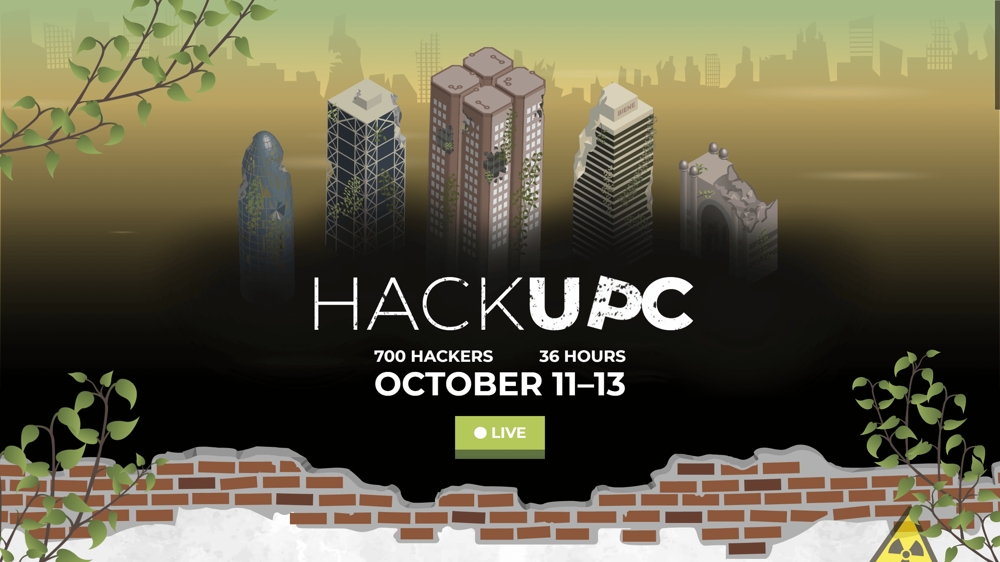

# HackUPC 2019 landing page



Hi! This is the code of the HackUPC 2019 landing page.

## Setup

Install the latest version Node.js (at least v10.15.3). [Find how here](https://nodejs.org/en/download/package-manager/).

```sh
git clone git@github.com:hackupc/frontend.git
cd frontend
npm install
```

## Develop

Use `npm run watch` to compile and serve the dist directory in real time. Then view the website at [https://localhost:8080](https://localhost:8080)

**Install linters** extensions in your favorite editor. In VS Code install: `HTMLHint`, `TSLint`, `maskdownlint`, `StandardJS` and `stylelint`. In other editors they may have similar names.
Or use `npm run lint` to run linters manually from the console to check errors.

We use linters to ensure code quality, please fix all the errors.

Because of cahe busting you may have to clean the cache when you reload to see changes. In Chrome you can do `Ctrl` + `F5`.

**TLDR;**

Run this:

```sh
npm run watch
```

View the website at [https://localhost:8080](https://localhost:8080)

## Deploy

### Deploy to localhost

Use `npm run dist` to compile all dist directory.
The files from `/src/` will be compiled to `/dist/`. Notice that the routes change, so when referencing files check where they are in [/dist/](/dist/]).

Use `npm run serve` to just serve `/dist` at [https://localhost:8080](https://localhost:8080).

**TLDR;**

Run this:

```sh
npm run dist
npm run serve
```

View the website at [https://localhost:8080](https://localhost:8080).

### Manual Deploy to HackUPC server

1. Ask ssh access to server
1. Add remote to your local git: `git remote add live ssh://deploy@hackupc.com/home/deploy/repo/w2017.git`
1. Push new changes to server (only master branch) with: `git push live master`

Inspired by this [article](https://www.digitalocean.com/community/tutorials/how-to-set-up-automatic-deployment-with-git-with-a-vps)

### HackUPC Server auto-deployment

In order to make development easier, we configured the server do auto-deployment from master. This is done using: `crontab`, `git` hooks and the `npm run dist` combined.

1. Add `*/15 * * * * cd /home/user/hackupc/frontend/ && git pull origin master > /home/user/hackupc/frontend/changes.log 2> /home/user/hackupc/frontend/install.log` to `crontab -e`
1. `vim .git/hooks/post-merge`
1. Write the following into the file:

```sh
#!/bin/sh
cd /home/user/hackupc/frontend/
npm update
echo "cleaning..."
npm run clean
echo "cleaning...done"
echo "compiling..."
npm run dist
echo "compiling...done"
echo "Deploy completed. The game is on!"
```

- `chmod +x .git/hooks/post-merge`

This makes crontab pull from the repo every 15 minutes. If changes happen, then the post-merge git hook is executed, effectively updating dependencies and compiling a new version of the site.

## Edit content

### Update legal documents

1. Just edit the Markdown files from [src/legal](src/legal)

### Add new logos

1. Checking the company brand use guidelines before editing the image.
1. Use .svg over .png.
1. The size should be greater than 600 x 300 px. They are scaled down automatically.
1. Remove the background if any.
1. Name the file in [snake_case](https://medium.com/swlh/string-case-styles-camel-pascal-snake-and-kebab-case-981407998841).
1. Place the file in [/src/images/logos/](/src/images/logos/).
1. If you plan to customize the logo, save the original in [/src/images/logos/originals/](/src/images/logos/originals/).

### Change theme

> TODO: fill this part

### Update schedule

> TODO: polish this part

Clients will poll constantly the schedule.json file. To update the schedule just change the file and deploy.  
New versions of the schedule will be loaded only if 'version' is different.

#### Schedule file

- `id` can be whatever you want, but all ids must be different  
- When writing hours, prepend zeroes: Nice: 01:00; Not-so-nice: 1:00.  
- Events should be ordered by starting hour  
- `baseTimeOffset` should be the same output as executing (new Date()).getTimezoneOffset() in a machine with local time. (UTC - localtime in minutes)  
- `dates` are DD/MM/YYYY format  

> If an event doesn't have endHour, then will show only startHour and it will finish at the same time as it starts.  
Useful to specify events that don't have concept of length or that span through more than one day ("Event start", "Event end")

### Change theme

> TODO: fill this part

## Live

Features included

- Optional subscription to events - 5 minutes before notifications
- Schedule live reload
- Fancy schedule with time padding
- Normal tabular schedule
- Countdown
- Full-screen mode by pressing `p`

### Config

Some parameters (offsets, timeouts, defaults) can be changed in `config.live.js`. Keep in mind that some values are just constants and should not be changed.  
Style can be customized in params.scss (note that some parameters should match some variables in config.live.js).

## Tech stack

This are the explanations of why we chose each technology, so you can decide whether keep it or change it.

### Conventions

#### English

> Write everything in english please, even comments

- More people can understand the code.
- Consistent with most libraries.

#### BEM

> [BEM Oficial website](http://getbem.com/naming/)

- Avoids unwanted styles and messy css.
- Browsers are faster styling by class than by tag.
- HTML is more clear.

#### Standard JS

> [Standard JS - Oficial website](https://standardjs.com/)

- It can reformat your code automatically so you don't lose time.

*I know... It's wierd not using semicolons, but js doesn't need them.*

### Node.js && npm

> [npm - Oficial website](http://npmjs.com/)

- Keep all libraries easyly updated (try noy to use it over cdn or downloading them yourself).
- Automate development and deployment.
- It's simple, so we can focus on other important tasks.
- It's cool!

### PostCSS

> [PostCSS - Oficial website](https://standardjs.com/)

- All CSS goodies in one package!
  - Minifyer
  - Pollyfills
  - Normalize.css
  - Autoprefixer

### GitHub

#### Coderain Bot

> [Coderain - Oficial website]()

#### Issues Bot

> [IssuesBot - Oficial website]()

#### Issues

#### Branches

## Support

If you need help understanding something of this repo you can ask the previous developers. The ones that made the 2019 edition are:

- Maurici Abad Gutierrez: Slack `@mauriciabad`

## License

MIT © Hackers@UPC
