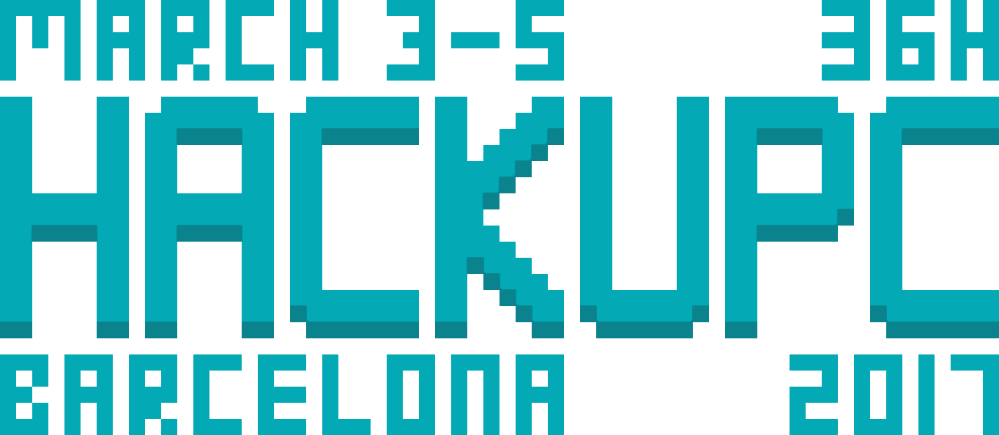

<br>
<p align="center">
  
</p>
<br>


# Setup

We recommend having Node v6 installed on your computer.

```sh
git clone git@github.com:hackupc/frontend.git &&
cd frontend &&
npm install
```


# Develop

Use `npm run watch` to compile and serve the dist directory in real time.

# Deploy

Use `npm run dist` to compile all dist directory.

Use `npm run serve` to serve `/dist` at `http://localhost:8080`.

Use `npm run nocache` to enable cache burst on `index.html`.


## HackUPC server

- Ask ssh access to server
- Add remote to your local git: `git remote add live ssh://deploy@hackupc.com/home/deploy/repo/w2017.git`
- Push new changes to server (only master branch) with: `git push live master`

Inspired by this [article](https://www.digitalocean.com/community/tutorials/how-to-set-up-automatic-deployment-with-git-with-a-vps)

# Live

Features included

- Optional subscription to events - 5 minutes before notifications
- Schedule live reload
- Fancy schedule with time padding
- Normal tabular schedule
- Countdown
- Full-screen mode by pressing `p`

## Config
Some parameters (offsets, timeouts, defaults) can be changed in config.live.js. Keep in mind that some values are just constants and should not be changed.  
Style can be customized in params.scss (note that some parameters should match some variables in config.live.js).  


## Schedule file
- `id` can be whatever you want, but all ids should be different  
- When writing hours, prepend zeroes: Nice: 01:00; Not-so-nice: 1:00.  
- Events should be ordered by starting hour  
- `baseTimeOffset` should be the same output as executing (new Date()).getTimezoneOffset() in a machine with local time. (UTC - localtime in minutes)  
- `dates` are DD/MM/YYYY format  

## Non-ranged events

If an event doesn't have endHour, then will show only startHour and it will finish at the same time as it starts.  
Useful to specify events that don't have concept of length or that span through more than one day ("Event start", "Event end")

## Updating schedule

Clients will poll constantly the schedule.json file. To update the schedule just change the file and deploy.  
New versions of the schedule will be loaded only if 'version' is different.


# License

MIT © Hackers@UPC
