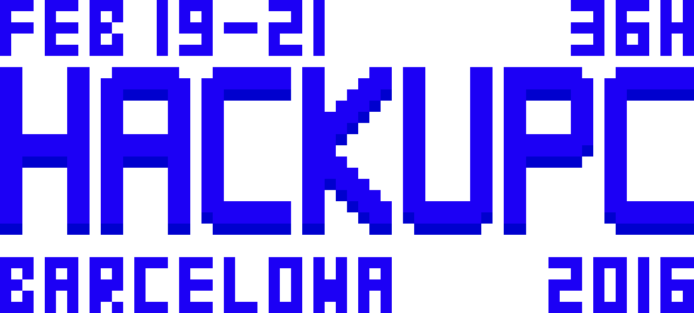

<br>
<p align="center">
  
</p>
<br>


# Setup

We recommend having Node v6 installed on your computer.

```sh
git clone git@github.com:hackupc/hackupc.git &&
cd hackupc &&
npm install
```


# Develop

Use `npm run watch` to compile the dist directory in real time.

Use `npm start` to serve `/dist` at `http://localhost:8080`.


## Live

*To be revisited*
> For testing purposes `live.js` has a `testing` variable that mocks events in the near future so that there's no need to keep changing `events.json`. It also reduces the polling rate to 1 second.

> New features:

> - Desktop notifications
- Live reload
- Options panel to filter by type of notifications
  - 4 types of notifications (provisional): essential, food, events, talks
  - essential notifications are always sent
  - food, events and talks can be filtered out depending on your preferences.
- Options panel also includes a checkbox to switch off background animation.
- Progress bars!


# License

MIT © Hackers@UPC
